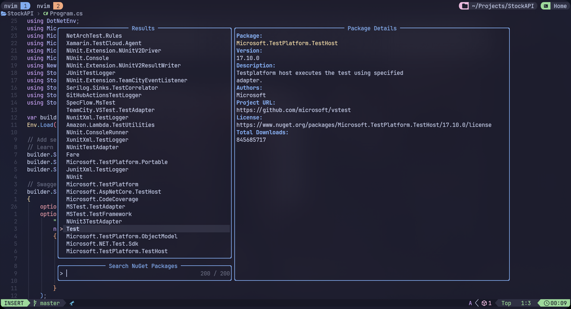

# NuGet Plugin for Neovim


This Neovim plugin allows you to manage NuGet packages within your .NET projects using Telescope for an interactive interface. It provides two main commands: `NuGetInstall` and `NuGetRemove`.

- `NuGetInstall`: Searches for a package with the provided search term, displays the results in Telescope with package details, and allows you to select a package version to install.
- `NuGetRemove`: Removes a package from the installed packages in the .NET project.

## Requirements

- Neovim 0.5.0 or later
- [plenary.nvim](https://github.com/nvim-lua/plenary.nvim)
- [telescope.nvim](https://github.com/nvim-telescope/telescope.nvim)
- [.NET SDK](https://dotnet.microsoft.com/en-us/download)

## Installation

### Using [lazy.nvim](https://github.com/folke/lazy.nvim)

If telescope.nvim and plenary.nvim are not already installed:

```lua
-- init.lua:
{
  "abdulrahmanDev1/nuget.nvim",
  dependencies = {
    "nvim-lua/plenary.nvim",
    "nvim-telescope/telescope.nvim",
  },
  config = function()
    require("nuget").setup()
  end,
}

-- or plugins/nuget.lua
return {
  "abdulrahmanDev1/nuget.nvim",
  dependencies = {
    "nvim-lua/plenary.nvim",
    "nvim-telescope/telescope.nvim",
  },
  config = function()
    require("nuget").setup()
  end,
}
```

If telescope.nvim and plenary.nvim are already installed:

```lua
{
  "abdulrahmanDev1/nuget.nvim",
  config = function()
    require("nuget").setup()
  end,
}
```

# Usage

### Commands

- `:NuGetInstall` - Search and install a NuGet package.
- `:NuGetRemove` - Remove an installed NuGet package.

### Keymaps

Default keymaps are provided but can be overridden in the setup function.

- `<leader>ni` - Install a NuGet package.
- `<leader>nr` - Remove a NuGet package.

# Configuration

The nuget.nvim plugin provides default keymaps for common operations but allows customization or disabling of these keymaps based on user preferences. Here are the details:

### Disabling Keymaps

To disable the default keymaps, you can pass an empty table to the keys option in the setup function:

```lua
require("nuget").setup({
    keys = {}
})
```

This will ensure no keymaps are set by the plugin.

### Custom Keymaps

You can also provide your custom keymaps by passing them to the keys option:

```lua
require("nuget").setup({
    keys = {
     -- action = {"mode", "mapping"}
        install = { "n", "<leader>pi" },
        remove = { "n", "<leader>pr" },
    }
})
```

This will override the default keymaps with the ones you provide.

## Contribution

If you want to contribute to this project, feel free to submit a pull request. If you find any bugs or have suggestions for improvements, please open an issue. All contributions are welcome!
