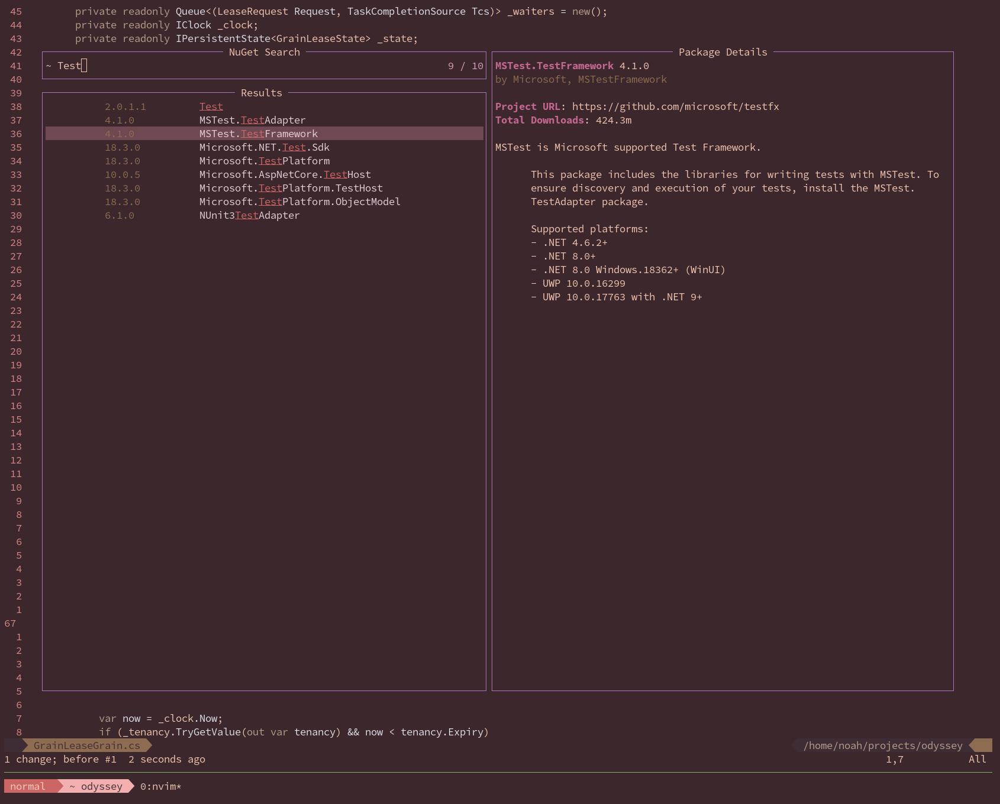
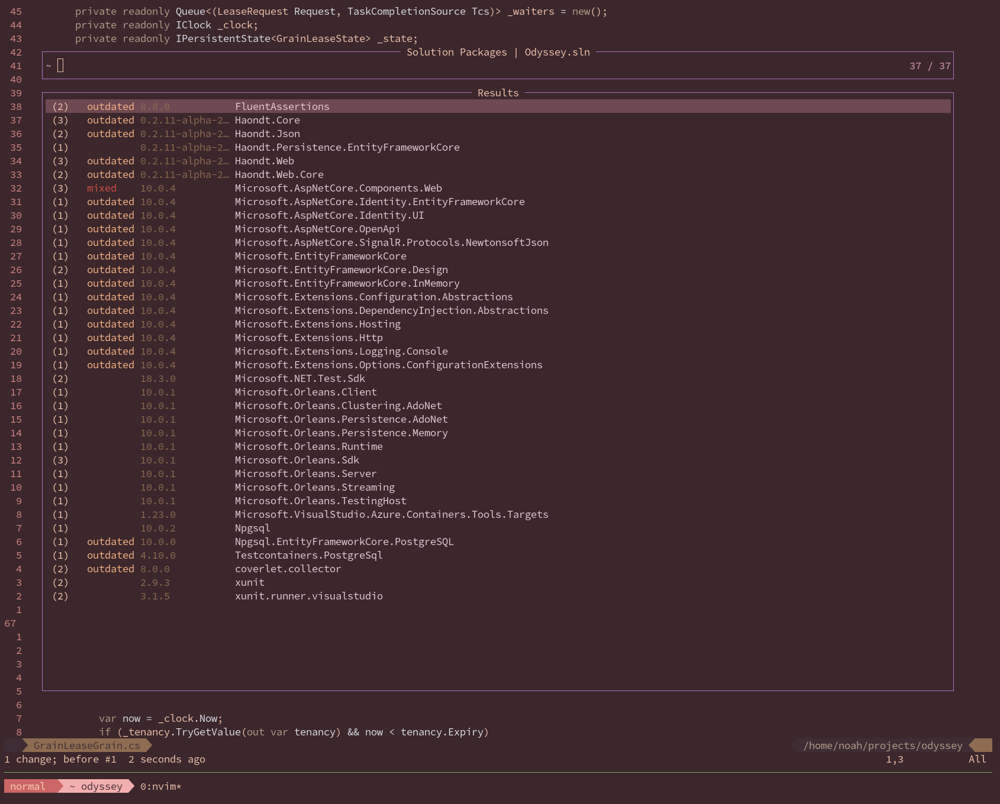
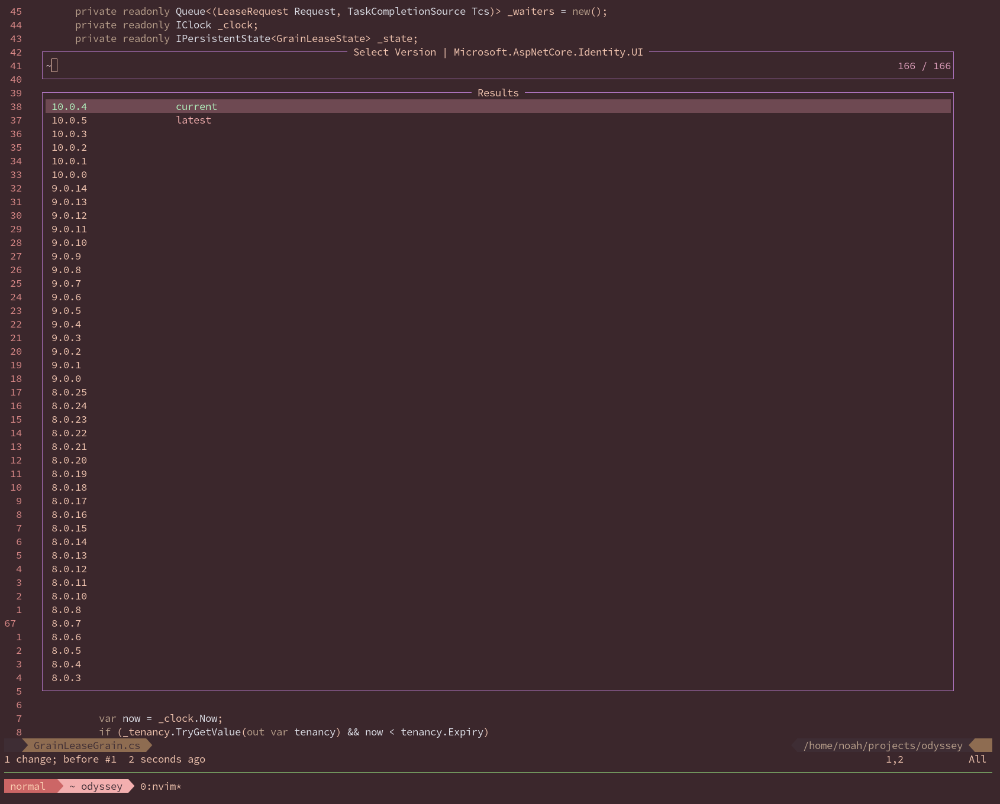
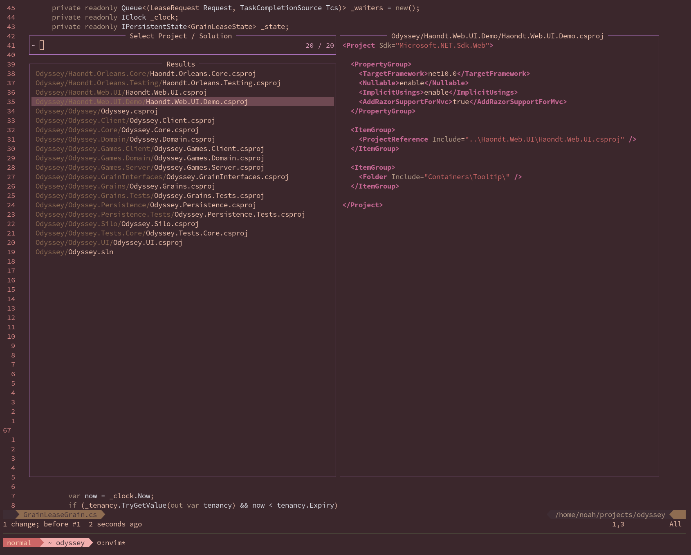

# NuGet Plugin for Neovim


This Neovim plugin allows you to manage NuGet packages within your .NET projects using Telescope for an interactive interface. It provides two main commands: `NuGetInstall` and `NuGetRemove`.

- `NuGetInstall`: Opens a 3-stage picker to select a target `.sln` or `.csproj`, search for a NuGet package to install, pick the desired version, and install it.
  - If a solution is picked, the second picker will only show packages installed in at least one project. Installed packages will be applied to all projects that already had that package, thus upgrading and/or consolidating installs.
  - If a project is picked, the second picker will use `dotnet packages search` to search for the package, and only install it on the selected project.
- `NuGetRemove`: Select a `.csproj` and remove packages from the installed packages in the .NET project.
- `NuGetClearCache`: Clears the internal cache used by the plugin. Not to be confused with NuGets own cache. 

## Requirements

- Neovim 0.5.0 or later
- [plenary.nvim](https://github.com/nvim-lua/plenary.nvim)
- [telescope.nvim](https://github.com/nvim-telescope/telescope.nvim)
- [fidget.nvim](https://github.com/j-hui/fidget.nvim) (optional)
- [.NET SDK](https://dotnet.microsoft.com/en-us/download)
- [fd](https://github.com/sharkdp/fd)

## Installation

### Using [lazy.nvim](https://github.com/folke/lazy.nvim)

```lua
-- init.lua:
{
    "d7omdev/nuget.nvim",
    dependencies = {
        "nvim-lua/plenary.nvim",
        "nvim-telescope/telescope.nvim",
        -- optional, show dotnet command output through fidget instead of vim.notify
        "j-hui/fidget.nvim",
    }
}
```

# Usage

### Commands

- `:NuGetInstall` - Search and install a NuGet package.
- `:NuGetRemove` - Remove an installed NuGet package.
- `:NuGetClearCache` - Clear the internal cache.

### Keymaps

Default keymaps are provided but can be overridden in the setup function.

- `<leader>ni` - Install a NuGet package.
- `<leader>nr` - Remove a NuGet package.
- `<leader>nc` - Clear nuget.nvim cache.

# Configuration

The nuget.nvim plugin provides default keymaps for common operations but allows customization or disabling of these keymaps based on user preferences. Here are the details:

### Disabling Keymaps

To disable the default keymaps, you can pass an empty table to the keys option in the setup function:

```lua
require("nuget").setup({
    keys = {}
})
```

This will ensure no keymaps are set by the plugin.

### Custom Keymaps

You can also provide your custom keymaps by passing them to the keys option:

```lua
require("nuget").setup({
    keys = {
     -- action = {"mode", "mapping"}
        install = { "n", "<leader>pi" },
        remove = { "n", "<leader>pr" },
        clear_cache = { "n", "<leader>pc" },
    }
})
```

This will override the default keymaps with the ones you provide.

### Project File Parsing

By default, the plugin will parse `.sln` and `.csproj` files with regular expressions. This is fast but error-prone. You can change the strategy to use `dotnet list`, which is more robust but slower.

```lua
require("nuget").setup({
    dotnet = {
        -- can be "parse" or "dotnet"
        method = "dotnet"
    }
})
```

### Picker Options

The install picker can be called with some custom options to configure how packages are managed.

```lua
require("nuget").setup({})
vim.keymap.set("n", "<leader>na", function()
    require("nuget.install")({ dotnet = { prerelease = true } })
end, { desc = "Install a NuGet prerelease package" })
```

It takes the following options:

```lua
{
    dotnet = {
        -- a list of string urls for any additional NuGet sources
        -- these will be passed to dotnet commands as `--source` arguments
        sources = {},
        -- enables `--prerelease` on dotnet commands
        prerelease = true,
        -- change the main binary used to call the dotnet api
        dotnet_bin = "dotnet"
    }
}
```

## Gallery

### Solution Search


### Version Select


### Target Search


## Contribution

If you want to contribute to this project, feel free to submit a pull request. If you find any bugs or have suggestions for improvements, please open an issue. All contributions are welcome!
